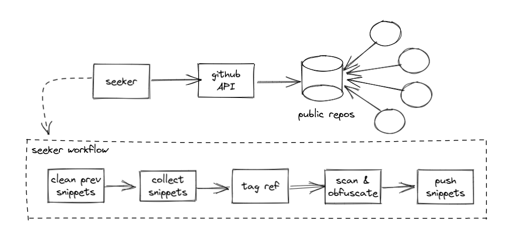

# Code Seeker

Code seeker is *in-development* repo for education purposes. The idea behind seeker is simply a BOT that seeks for
latest new source codes pushed to random open source projects and public repositories hosted in Github, collecting
code snippet for later to be analyzed.

**The basic life-cyle is:**



1. seeker bot runs every day through [Github workflow](.github/workflows/run-seeker.yml)
2. using Github API it searches for public repos and collects source code snippets based on a [configuration](seeker/seeker.conf)
3. using obfuscation mechanism seeker bot will override any sensitive data from the snippets collected
4. a header is added for each snippet as references for the source repo, author and file
5. purges the local snippet, collected from the previous run and push the new snippets to [snippet folder](seeker/snippet)

**report**

* by language
* monitoring specific repo
* by stars
* by period (daily, monthly, yearly)

**code sample**

* by file extension

## Requirements
* GitHub OauthAPI GITHUB_TOKEN
* Python 3

## Setup dev env

```shell
git clone git@github.com:eduardocerqueira/seeker.git
cd seeker
sh ops/scripts/set_dev_env.sh
```

## Build

```shell
sh ops/scripts/egg_build.sh
```

## Install

```shell
# from local build
python3 -m venv venv
source venv/bin/activate
pip install dist/seeker-0.0.1.tar.gz

# from local path with editable
git clone git@github.com:eduardocerqueira/seeker.git
cd seeker
pip install -e .
```

## Run

```shell
export GITHUB_TOKEN=**********
cd seeker
seeker --help
seeker --test
seeker
```

check [report](seeker/report.txt)

## Container

```shell
# build
sh ops/scripts/docker_build.sh
# manually
docker build --build-arg SEEKER_RUN="--test" -t seeker -f Dockerfile . --network host

# run
sh ops/scripts/docker_run.sh
# manually
docker run -e GITHUB_TOKEN=$GITHUB_TOKEN -e GITHUB_USERNAME="eduardocerqueira" -e GITHUB_EMAIL="eduardomcerqueira@gmail.com" -it seeker /bin/bash
```

## Contributing

Feel free to send PR's and/or file issues. Please remember running black as showing below before sending your PR.

```shell
pre-commit run --all
```

## Links

* https://gist.github.com/discover
* https://github.com/search?p=2&q=etcd&type=Repositories
* https://docs.github.com/en/rest/reference/repos
* https://pygithub.readthedocs.io/en/latest/
